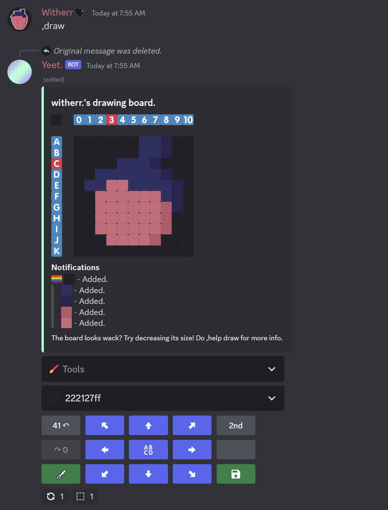
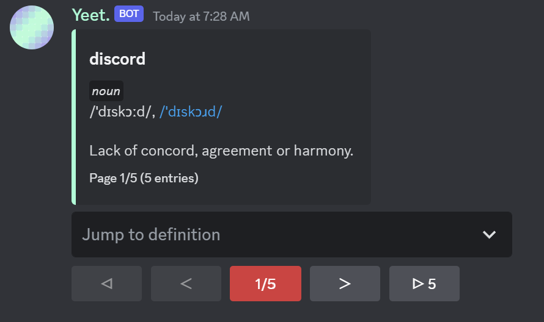
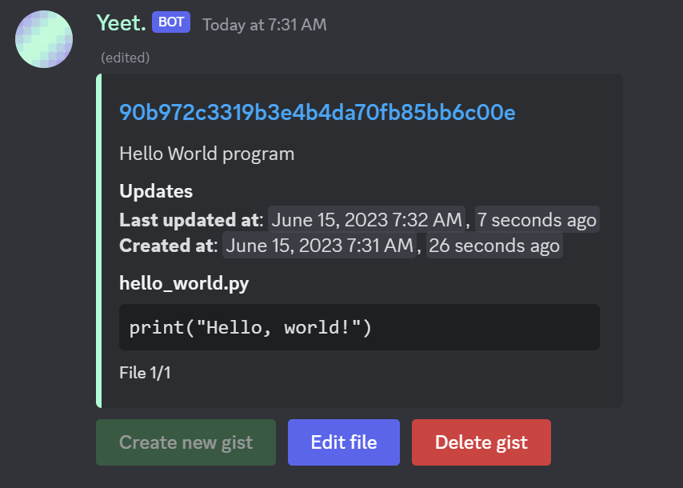
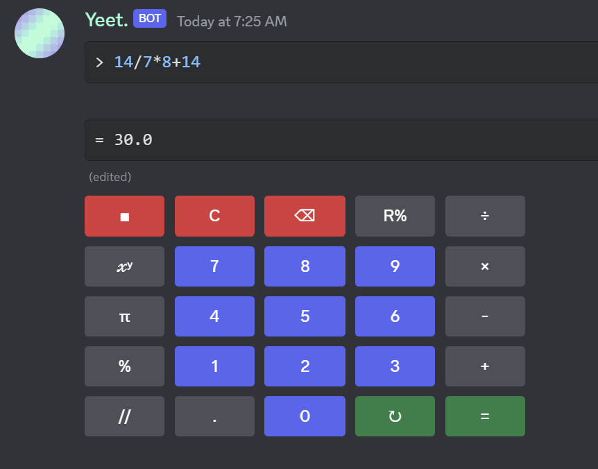

# **Yeet.** Discord Bot
# [Click here to invite the bot :)](https://discord.com/oauth2/authorize?client_id=634409171114262538&scope=bot+applications.commands&permissions=138513083472)

**Yeet.** is a Discord bot made with love that offers a range of unique and useful features to make your Discord experience more enjoyable. Below are some of its more prominent features!
I hope you can give it a try! :D

## Features
### Draw/Pixel Art command
**Yeet.**'s `draw` command is a unique and original command where you can create pixel art directly on Discord with a wide range of features!
The draw command is the main feature of the bot that I have poured my heart and soul into over the course of 6+ months. This is not meant to be a professional drawing platform obviously, but it still provides an opportunity for fun regardless, to create and share silly pixel art with your friends!
- Access various tools such as a basic brush, fill tool, darken/lighten tools to darken/lighten pixels, etc using buttons and dropdown menus to provide a user-friendly interface
- Comes with a wide range of customizability to express the artist in you, in a bite-size form
    - Add ANY custom color
    - Extract and add colors from an **emoji** or **image**
    - Add emojis to the palette, and more
    - Mix multiple colours to create new colours
- It provides a bite-size but feature-packed drawing experience that you can have fun with, directly on Discord
- More features such as timelapse, showcase forum, palette presets, etc are planned!

Here, I roughly recreated my Discord profile picture!

### Define command
**Yeet.**'s `define` command allows you to find the definitions on a term or phrase and various other information such as examples, synonyms, antonyms, etc. The information is presented in a neat and paginated format, which you can interact with using buttons and dropdown menus. Settle that debate about the meaning of a word or find that word at the tip of your tongue without even having to leave the app!

### Gist command
**Yeet.**'s `gist` command provides an intuitive interface to interact with Github Gists, allowing you to create, edit, delete, view gists, etc, directly from Discord. The interface uses dropdown menus, pagination between files, buttons, and modals to make it easy to input and edit text into gists. With this command, you can easily share snippets of code or other text with your friends without having to leave Discord or the hassle of finding a reliable paste service.

### Calculator command
**Yeet.**'s `calculator` command provides a unique and interactive calculator interface using buttons that can be used to perform arithmetic calculations quickly with its intuitive and easy to use interface. **Yeet.** also offers a simple calculator command for when you need quick calculations without all that fanciness!

### Pokétwo helper commands
Pokétwo is a Pokémon Discord bot. **Yeet.** offers unique helper commands for it, such as
- Extracting Pokémon IDs directly from an embed
- Viewing the spawn chance of different Pokémon, rarities, forms, type combinations, event Pokémon, and more
- A `moveinfo` command that allows you to view move information such as *all the Pokémon that learn a move*, which can be useful in a pinch during a battle.
All these commands directly use Pokétwo's game data to provide you with 100% accurate information that may otherwise be difficult to find.

### Channel commands
**Yeet.** provides unique channel commands that allow you to perform modification tasks on channels, such as lock, unlock, rename, strip, and more with which you can easily manage your Discord channels.

### Wikipedia command
**Yeet.**'s `wikipedia` command allows you to find Wikipedia information about any topic using the Wikipedia API. The wikipedia command works hand-in-hand with the define command to provide you with information right within Discord.

### Other features
**Yeet.** also improves upon features from other bots, such as R. Danny, such as
- Intuitive pagination of appropriate commands (improved upon to match **Yeet.**'s needs)
- Easy Discord.py, PIL, pymongo, etc documentation command to view documentation of entities from the library, improved upon by including source code of entities and pagination using buttons
- A robust help command inherited from R. Danny's help command to provide a highly customized help command
- A intuitive info command to view user info, improved upon with role support
- A permissions command to view the permissions of a member of a server
- Error handling in various cases, taken and improved from Pokétwo.

## Planned features
**Yeet.** is still in its early stages, and much more content is planned. I'll be adding new unique features and improving upon old ones to make **Yeet.** even more feature-packed and enjoyable to use. Any constructive criticism or suggestions are highly appreciated!
